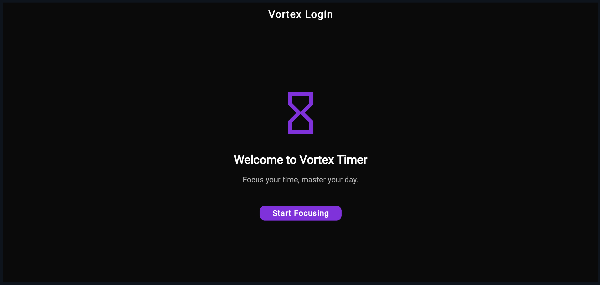
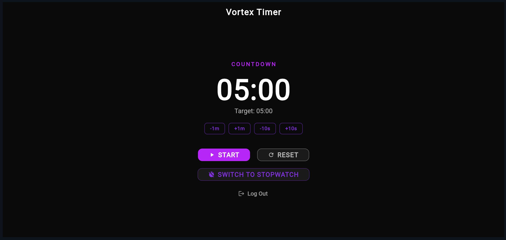
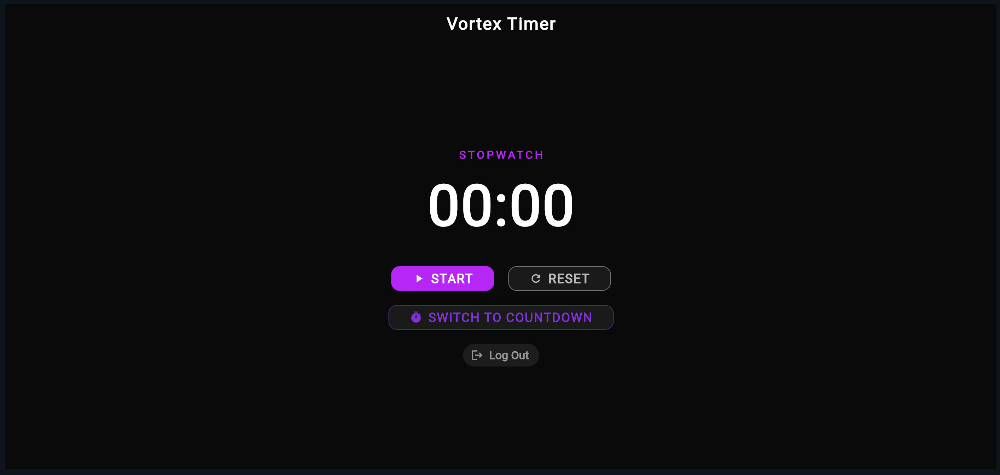

# ⏳ Vortex Timer

A minimal and modern **Flutter-based Timer App** designed to help you focus, track time, and stay productive.

---

## 🚀 Features

- ⏱️ **Countdown Timer**
  - Set and adjust time easily (+1m, -1m, +10s, -10s)
  - Start and reset functionality
  - Target time display

- 🕒 **Stopwatch Mode**
  - Start, track, and reset time
  - Clean and distraction-free interface

- 🔄 **Mode Switching**
  - Seamlessly switch between **Countdown** and **Stopwatch**

- 🎯 **Minimal UI**
  - Dark theme with neon purple accents
  - Centered, distraction-free design

- 🔐 **Login Screen (UI)**
  - Simple welcome screen with "Start Focusing" entry point

---

## 🖼️ Screenshots

### 🔑 Login Screen

### ⏳ Countdown Timer

### 🕒 Stopwatch

---

## 🛠️ Tech Stack

- **Flutter** (Dart)
- Material UI
- Stateful Widgets

---

## 🚀 Run Locally
git clone https://github.com/Aakira14/vortex-timer.git
cd vortex-timer
flutter pub get
flutter run

## 📱 Requirements
Flutter SDK
Emulator or physical device

## Check setup:

flutter doctor

That’s it—simple, no extra fluff 😎
